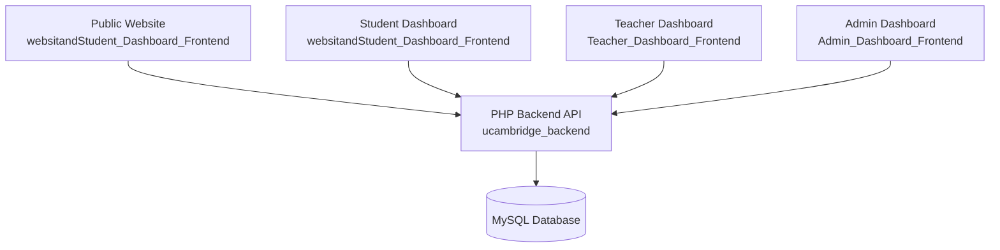

# uCambridge — Online English Learning Platform

A multi-role online English learning platform with separate frontend applications for the public website, students, teachers, and administrators. The system is backed by a centralized PHP/MySQL backend and uses session-based authentication.

## Overview

uCambridge is a platform designed to support online English learning workflows across several user roles:

- Public visitors and prospective students
- Student dashboard users
- Teacher dashboard users
- Admin users managing the platform

The implementation is not a single monolithic app. It is composed of multiple independent frontend applications that all connect to the same backend service layer.

This project includes:

- Public Website + Student Dashboard in `websitandStudent_Dashboard_Frontend`
- Teacher Dashboard in `Teacher_Dashboard_Frontend`
- Admin Dashboard in `Admin_Dashboard_Frontend`
- Central PHP/MySQL backend in `ucambridge_backend`

The platform is a working educational product architecture with role-based access, course management, assignment workflows, placement test flows, payments, reports, and admin controls.

## Live Platform

- Website: https://ucambridge.com
- Repository: https://github.com/Eng-Hussein-Saif/UCambridge-Online-English-PlatForm

## Repository Structure

```text
ucambridgeplatform/
├── websitandStudent_Dashboard_Frontend/
│   ├── src/
│   ├── public/
│   ├── package.json
│   ├── vite.config.ts
│   └── ...
├── Teacher_Dashboard_Frontend/
│   ├── src/
│   ├── public/
│   ├── package.json
│   ├── vite.config.ts
│   └── ...
├── Admin_Dashboard_Frontend/
│   ├── src/
│   ├── public/
│   ├── package.json
│   ├── vite.config.ts
│   └── ...
├── ucambridge_backend/
│   ├── admin/
│   ├── student/
│   ├── teacher/
│   ├── config/
│   ├── services/
│   ├── middleware/
│   ├── messages/
│   ├── notifications/
│   ├── uploads/
│   └── ...
├── docs/
│   ├── architecture.md
│   ├── authentication.md
│   ├── authorization.md
│   ├── api-reference.md
│   ├── database.md
│   ├── features.md
│   ├── data-flows.md
│   ├── deployment.md
│   └── engineering-decisions.md
├── README.md
└── ...
```

## Key Features

### Public Website

The public app includes:

- Home page
- Login page
- Registration page
- Placement test flow
- Forgot password flow
- Under-construction page
- Not-found page

### Student Features

The student dashboard includes actual implemented flows for:

- Dashboard
- Courses
- Course details
- Lessons and learning materials
- Assignments
- Schedule
- Live classes
- Payments
- Exams
- Certificates
- Notifications
- Messages
- Profile
- Settings
- Learning path
- Feedback
- Tests
- Placement test flow

### Teacher Features

The teacher dashboard includes:

- Dashboard
- Courses
- Students
- Attendance
- Live classes
- Exams
- Assignments
- Materials
- Messages
- Reports
- Resources
- Notifications
- Profile
- Settings
- Gamification
- Schedule

### Admin Features

The admin dashboard includes:

- Dashboard
- Students management
- Teachers management
- Courses management
- Exams
- Assignments
- Payments
- Payment methods
- Levels
- Placement tests
- Placement interviews
- Live classes
- Reports
- Announcements
- Suggestions
- Evaluations
- Certificate design
- Messages
- Notifications
- Settings
- Permissions

## Architecture

The architecture follows a multi-frontend + centralized backend model.



The important architectural pattern is:

- Each frontend app is independent
- All frontends authenticate against the same backend
- The backend uses PHP session authentication
- The data layer is MySQL accessed via PDO

## Technology Stack

### Frontend

| Area | Implementation |
|------|----------------|
| Framework | React |
| Language | TypeScript |
| Build Tool | Vite |
| Router | React Router DOM |
| UI | Tailwind CSS + shadcn/radix-style component patterns |
| State | Context providers, React Query, local storage for auth metadata |
| Forms | React Hook Form |
| Validation | Zod |
| Charts | Recharts |
| Notifications | Sonner |
| File/document processing | mammoth, xlsx, react-pdf |

### Backend

| Area | Implementation |
|------|----------------|
| Language | PHP |
| Database | MySQL |
| DB access | PDO |
| Server environment | Apache / XAMPP |
| Auth | PHP sessions and cookies |
| Mail | PHPMailer |
| Push notifications | Web Push package |
| CORS | Custom PHP CORS handling |

Version information was not consistently verified in the project files, so versions are intentionally omitted where they were not confirmed.

## Authentication and Authorization

The active authentication strategy is PHP session-based authentication.

### Authentication flow

- Student login calls `/student/login.php`
- Teacher login calls `/teacher/login.php`
- Admin login calls `/admin/login.php`
- Each backend endpoint validates credentials against the database
- A PHP session is created and stored in the browser through cookies
- Protected frontend routes call `check_auth` endpoints to validate the session
- Frontend route guards redirect users if not authenticated

### Authorization

The platform implements role-based access at multiple levels:

- Student protected routes
- Teacher protected routes
- Admin protected routes
- Admin permission mapping and accessibility checks

The admin panel explicitly contains permission metadata and page access checks using values such as:

- `accessible_pages`
- `permissions`
- `is_super_admin`

## Backend Architecture

The backend is a PHP endpoint-based application, not a Laravel or Node framework, based on the inspected implementation.

```text
ucambridge_backend/
├── admin/
│   ├── login.php
│   ├── check_auth.php
│   ├── logout.php
│   └── ...
├── student/
│   ├── login.php
│   ├── check_auth.php
│   ├── logout.php
│   └── ...
├── teacher/
│   ├── login.php
│   ├── check_auth.php
│   ├── logout.php
│   └── ...
├── config/
│   ├── database.php
│   ├── cors_helper.php
│   ├── auth.php
│   └── ...
├── middleware/
├── services/
├── messages/
├── notifications/
├── uploads/
└── ...
```

## API Architecture

The API layer consists of direct PHP endpoints grouped by role.

Examples of verified backend endpoints include:

- `/student/login.php`
- `/student/check_auth.php`
- `/student/logout.php`
- `/student/register.php`
- `/student/get_enrolled_courses.php`
- `/teacher/login.php`
- `/teacher/check_auth.php`
- `/teacher/logout.php`
- `/teacher/get_courses.php`
- `/teacher/get_assignments.php`
- `/admin/login.php`
- `/admin/check_auth.php`
- `/admin/logout.php`
- `/admin/get_dashboard_stats.php`

The actual project uses HTTP/JSON endpoints with PHP session authentication rather than a token-based API layer.

## Database Architecture

The database is MySQL and is accessed through PHP PDO.

From the actual files, the platform uses core domain tables such as:

- users
- students
- teachers
- courses
- lessons
- materials
- assignments
- exams
- reports
- payments
- payment_methods
- notifications
- announcements
- live_classes
- schedule
- levels

The full schema was not invented in this documentation. Only domain areas directly referenced by the implementation were included.

## Project Status

The project is a real implementation of a multi-role educational platform with:

- multi-frontend architecture
- centralized backend
- database-backed workflows
- student, teacher, and admin role separation
- session-based authentication
- admin permission enforcement

This is a real product-style implementation, not a single landing page or fake demo.

## Security Notes

Security mechanisms that are actually present in the implementation include:

- PHP session validation
- Password verification using `password_verify`
- Protected frontend route guards
- Protected admin route access checks
- CORS handling in backend files
- Session regeneration on successful login

This project does include security-relevant implementation details, but the documentation does not claim full production hardening beyond what is explicitly present in the code.

## Documentation

This README is accompanied by the following technical documentation files:

- [docs/architecture.md](docs/architecture.md)
- [docs/authentication.md](docs/authentication.md)
- [docs/authorization.md](docs/authorization.md)
- [docs/api-reference.md](docs/api-reference.md)
- [docs/database.md](docs/database.md)
- [docs/features.md](docs/features.md)
- [docs/data-flows.md](docs/data-flows.md)
- [docs/deployment.md](docs/deployment.md)
- [docs/engineering-decisions.md](docs/engineering-decisions.md)

## My Role

This repository represents the implementation and engineering work behind the uCambridge platform, including the frontend applications, backend integrations, authentication flows, role-based access control, and data handling.

## Screenshots

No verified screenshots were identified in the project structure at the time of review, so this section intentionally avoids inventing image assets. The project documentation can be expanded later with screenshots when the corresponding visual assets are available.

## Engineering Highlights

- Multi-application React architecture
- Centralized PHP/MySQL backend
- Session-based authentication across frontends
- Role-based access control
- Admin permission system
- Course, assignment, exam, and payment workflows
- Real database integration

## Summary

uCambridge is a multi-role online English learning platform designed around role-based access and a centralized PHP backend. The implementation is real, structured, and domain-specific, with separate student, teacher, and admin experiences connected to the same database-backed system.

---

This project documentation reflects the implementation actually present in the workspace and intentionally avoids assumptions about roles or technologies that were not verified.
