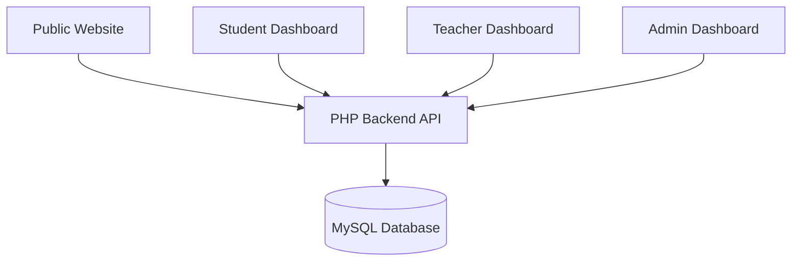
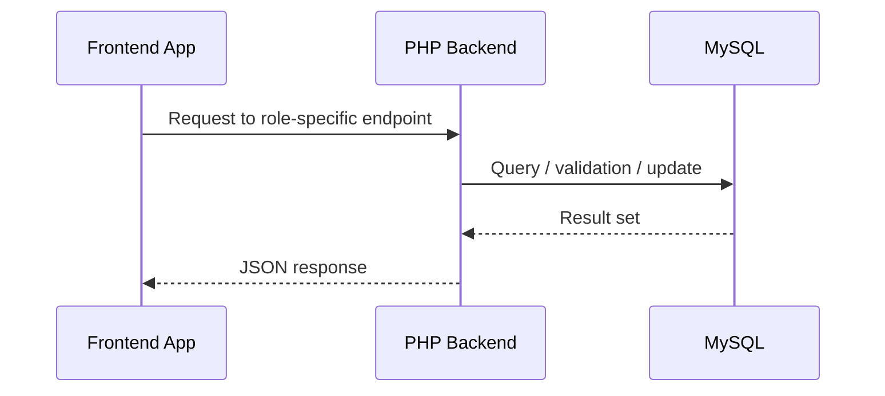

# Architecture

## Overview

uCambridge is implemented as a multi-application platform rather than a single frontend. The project structure contains several independent frontend applications that all connect to the same PHP backend and MySQL database.

The verified architectural model is:

- `websitandStudent_Dashboard_Frontend` contains the public website and the student dashboard
- `Teacher_Dashboard_Frontend` contains the teacher dashboard
- `Admin_Dashboard_Frontend` contains the admin dashboard
- `ucambridge_backend` contains the centralized PHP backend and MySQL access layer

## High-Level Diagram



## Frontend Applications

### 1. Public Website + Student Dashboard

The public site and student dashboard are part of the same frontend project at:

- `websitandStudent_Dashboard_Frontend`

The routing is separated by app module and by route namespace. The public app is in `src/app/main-app` and the protected student dashboard is in `src/app/student-dashboard`.

Relevant files:

- `src/app/router.tsx`
- `src/app/main-app/App.tsx`
- `src/app/student-dashboard/App.tsx`

### 2. Teacher Dashboard

The teacher dashboard is a separate project:

- `Teacher_Dashboard_Frontend`

Relevant files:

- `src/App.tsx`
- `src/contexts/AuthContext.tsx`
- `src/lib/teacherApiClient.ts`

### 3. Admin Dashboard

The admin dashboard is also a separate project:

- `Admin_Dashboard_Frontend`

Relevant files:

- `src/App.tsx`
- `src/services/authService.ts`
- `src/components/auth/ProtectedRoute.tsx`

## Backend

The backend is centralized in:

- `ucambridge_backend`

It is organized by role and by infrastructure concerns:

```text
ucambridge_backend/
├── admin/
├── student/
├── teacher/
├── config/
├── middleware/
├── services/
├── messages/
├── notifications/
├── uploads/
└── ...
```

This indicates a PHP endpoint-based system rather than a full framework router. Each role provides its own set of endpoints and auth checks.

## Database Layer

The project uses MySQL with PHP PDO:

- `ucambridge_backend/config/database.php`

This file is the real database access point for the backend application.

## Request Flow Pattern



## Key Architectural Characteristics

- Multiple frontends share the same data backend
- PHP session auth is used for all verified user authentication
- The backend is organized by role: student, teacher, admin
- Frontend routes are protected using route guards and session checks
- Admin controls include permission-aware protections

## Observed Role Mapping

| Role | Frontend app | Backend module |
|------|---------------|----------------|
| Visitor / Public | Public website app | Public routes and general endpoints |
| Student | Student dashboard app | `student/` |
| Teacher | Teacher dashboard app | `teacher/` |
| Admin | Admin dashboard app | `admin/` |

## Architectural Conclusion

The system is best described as a multi-frontend educational platform backed by a centralized PHP/MySQL backend. This architecture supports independent business experiences while keeping all role-specific logic and data access in one backend service.
