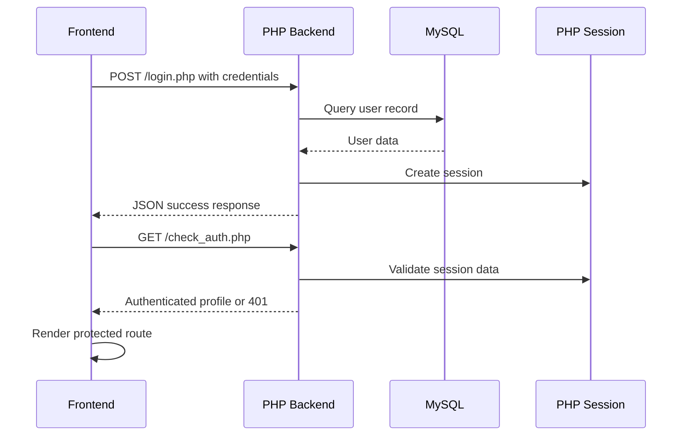

# Authentication

## Summary

The verified authentication architecture is PHP session-based authentication using browser cookies and server-side session data.

## Student Authentication

### Login flow

The student login endpoint is:

- `/student/login.php`

Files involved:

- `ucambridge_backend/student/login.php`
- `websitandStudent_Dashboard_Frontend/src/app/main-app/services/authService.ts`

The backend performs the following checks:

- email presence
- password presence
- valid student record
- account active state
- password verification using `password_verify`
- session creation through `session_start()`

After a successful login, the backend sets session values such as:

- `student_logged_in`
- `student_id`
- `user_id`
- `student_name`
- `student_email`
- `student_level`
- `role`

### Check auth

The verification endpoint is:

- `/student/check_auth.php`

This endpoint checks the live PHP session and responds with either:

- authenticated user data
- `401` if the session is not valid

### Logout

Student logout occurs via:

- `/student/logout.php`

This endpoint clears the session and destroys the session cookie if present.

## Teacher Authentication

### Login flow

The teacher login endpoint is:

- `/teacher/login.php`

Files involved:

- `ucambridge_backend/teacher/login.php`
- `Teacher_Dashboard_Frontend/src/services/authService.ts`
- `Teacher_Dashboard_Frontend/src/contexts/AuthContext.tsx`

Authentication checks include:

- valid teacher email
- valid password
- teacher role requirement
- active account status
- `password_verify`
- session generation

### Check auth

Teacher session validation is performed by:

- `/teacher/check_auth.php`

This endpoint checks whether the teacher is logged in and whether the session is still valid before returning teacher details.

### Logout

Teacher logout is handled by:

- `/teacher/logout.php`

## Admin Authentication

### Login flow

The admin login is processed by:

- `/admin/login.php`

Relevant files:

- `ucambridge_backend/admin/login.php`
- `Admin_Dashboard_Frontend/src/services/authService.ts`

The login flow includes:

- role validation
- credentials validation
- session creation
- permission metadata returned to the frontend

### Check auth

Admin session validation is handled by:

- `/admin/check_auth.php`

### Logout

Admin logout is handled by:

- `/admin/logout.php`

## Session and Cookie Model

The platform uses PHP sessions and browser cookies, not token-based auth.

The backend sets and validates session state using:

- `session_start()`
- `session_regenerate_id(true)`
- `session_destroy()` on logout
- `credentials: 'include'` in frontend fetch calls

This is the actual pattern used by the application.

## Protected Frontend Routes

The implementation uses route guards to protect user-accessible areas.

Examples:

- `websitandStudent_Dashboard_Frontend/src/app/student-dashboard/components/ProtectedRoute.tsx`
- `Teacher_Dashboard_Frontend/src/App.tsx`
- `Admin_Dashboard_Frontend/src/components/auth/ProtectedRoute.tsx`

The frontend route guard checks whether a valid session is present before rendering the protected application area.

## Mermaid Sequence Diagram

## Important Note

This project uses PHP session-based authentication and cookie-based browser persistence.
