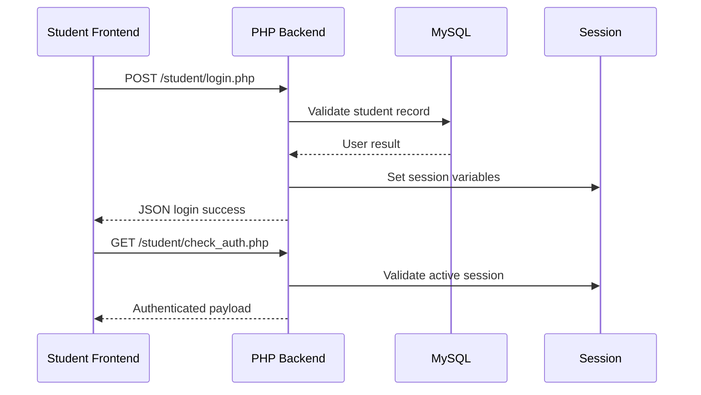
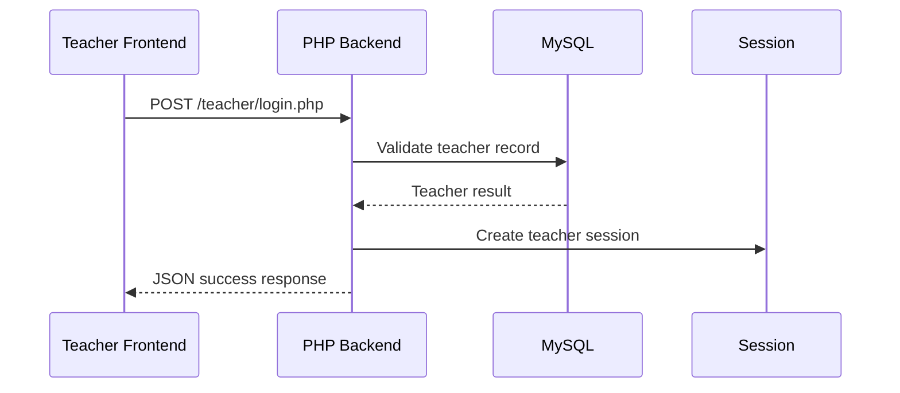
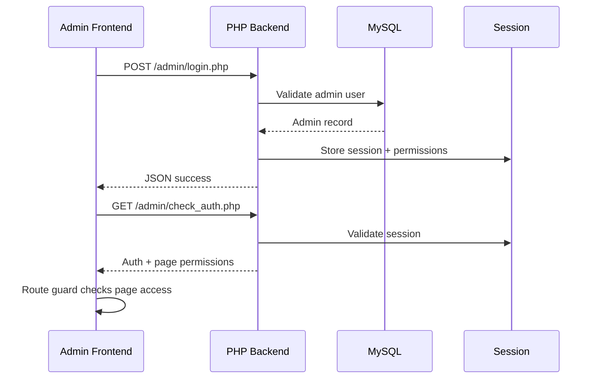
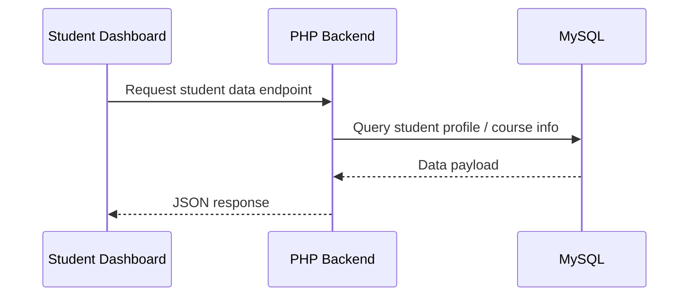
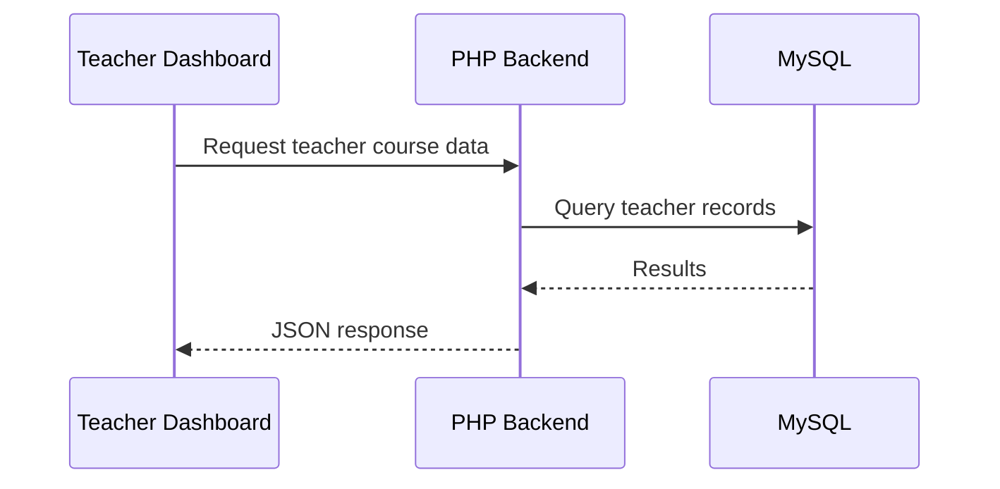
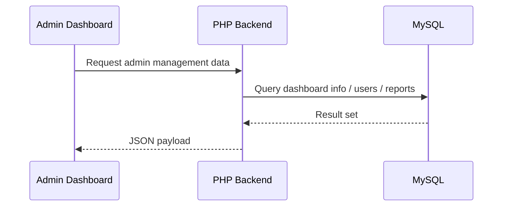

# Data Flows

## Student Login Flow

## Teacher Login Flow

## Admin Login + Permission Flow

## Student Retrieves Data

## Teacher Retrieves Data

## Admin Retrieves Data

## Student Submits Data

The same pattern is used when a student submits assignments, feedback, or profile updates:

- frontend calls backend endpoint
- backend validates session
- backend updates or inserts rows in MySQL
- JSON response is returned

## Teacher Submits Data

Teacher updates to courses, materials, assignments, announcements, or reports follow the same pattern.

## Admin Modifies Data

Admin modifications to course, user, payment, announcement, and permission data follow the same backend + database model with stronger access checks.
