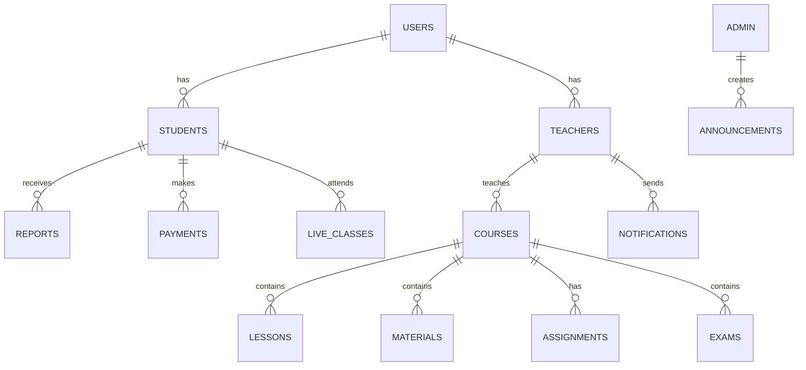

# Database

## Database Engine

The active database is MySQL. The backend connects using PHP PDO from:

- `ucambridge_backend/config/database.php`

## Core Database Access Pattern

The application uses a centralized PDO-based connection layer rather than an ORM. Query logic is implemented directly in PHP files and service modules.

## Verified Domain Areas

The implementation clearly references these major domains:

- users
- students
- teachers
- courses
- lessons
- materials
- assignments
- exams
- reports
- payments
- payment_methods
- notifications
- announcements
- live_classes
- schedule
- levels

## Relationship Notes

The exact full schema and every column definition were not fully enumerated in the inspected source. This document therefore reports only the table family and domain relationships that are visibly supported by the implementation.

## ER Diagram

## Important Constraints

This is intentionally conservative documentation:

- No unsupported tables were invented
- No foreign key relationships were invented beyond the obvious domain ownership implied by the code structure
- No schema assumptions were converted into facts

## Database Summary

The platform is designed around a relational MySQL schema with user, course, learning, communication, payment, and administration domains. The backend uses direct SQL queries via PDO to support role-based workflows and session-aware user operations.
